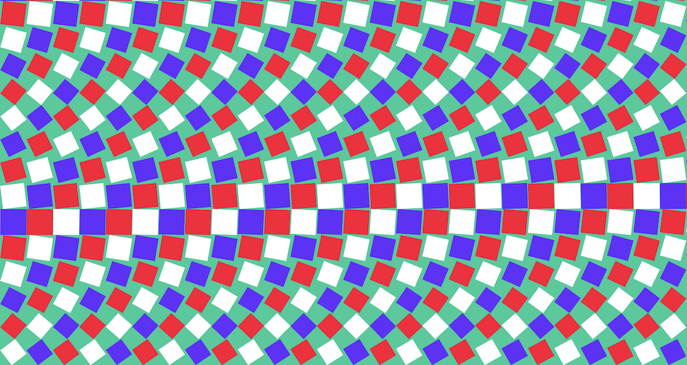

# react-pts-canvas

[](https://www.npmjs.com/package/react-pts-canvas)



`react-pts-canvas` includes React components for canvas drawing using [Pts](https://ptsjs.org). You can also check out some usage examples in the `src` folder here, and more in [`react-pts-canvas-examples`](https://williamngan.github.io/react-pts-canvas-examples/build/) repo.

> ### Breaking changes in v0.4
>
> 1. `onReady: (space, form, bound) => void` replaces the old handler `onStart: (bound, space, form) => void`
>
> 2. Legacy class based component are removed. Please use the 0.3.x version if you still need the class component

[Pts](https://ptsjs.org) is a javascript library for visualization and creative-coding. You may use Pts by itself, or with React and other frameworks.

If you are getting started with Pts, take a look at the [demos](https://ptsjs.org/demo) and read the [guides](https://ptsjs.org/guide).

## Install

```bash
npm install --save react-pts-canvas
```

## Examples

- See examples in [react-pts-canvas-examples](https://github.com/williamngan/react-pts-canvas-examples) repo
- The [src](./src) folder in this repo also provides some quick examples

## PtsCanvas functional component

`PtsCanvas` is a functional component that helps you get started on Pts in React. A quick example as follows (please refer to [this guide](https://ptsjs.org/guide/space-0500) to learn more about these functions).

`PtsCanvas`

```jsx
/* App.js */
<PtsCanvas
  name='myClassName'
  onReady={ (space, form, bound) => {...} }
  onAnimate={ (space, form, time, ftime) => {...} }
  onResize={ (space, form, size, evt) => {...} }
  onAction={ (space, form, type, px, py, evt) => {...} }
/>
```

```css
/* App.css */
.myClassName {
  position: absolute;
  top: 0;
  left: 0;
  right: 0;
  bottom: 0;
}
```

`PtsCanvas` component makes use of the `useEffect` hook to handle lifecycle events, and the `useRef` hook to maintain reference to the space, form, and canvas elements. It provides the following props:

- `name`
  - The css class name of the container `<div>`. Default value is "pts-react". Use this class name to set custom styles in your .css file.
- `className`
  - Additional class names to be appended
- `background`
  - background fill color of the canvas. Default value is "#9ab".
- `onReady`
  - onReady handler function
- `onAnimate`
  - onAnimate handler function
- `onResize`
  - onResize handler function
- `onAction`
  - onAction handler function
- `play`
  - A boolean value to set whether the canvas should animate. Default is `true`.
- `resize`
  - A boolean value to indicate whether the canvas should auto resize. Default is `true`.
- `retina`
  - A boolean value to indicate whether the canvas should support retina resolution. Default is `true`.
- `touch`
  - A boolean value to set whether the canvas should track mouse and touch events. Default is `true`.
- `style`
  - Optionally override css styles of the container `<div>`.
- `canvasStyle`
  - Optionally override css styles of the `<canvas>` itself. Avoid using this except for special use cases.
- `tempo`
  - a `Tempo` object. In a parent component, you can create a ref to a tempo object, add functions to it via `Tempo.every` in your onReady handler, then pass that `Tempo`'s ref.current as this prop. The `tempo` will be added to the space with the other handlers.
- `spaceRef`
  - a ref returned from `useRef(null)` if you need reference to the space in your parent component
- `formRef`
  - a ref returned from `useRef(null)` if you need reference to the form in your parent component

### Canvas ref access

`PtsCanvas` is wrapped with `forwardRef`, so you can pass a ref to the component itself if you need
access to the canvas ref within your parent component:

```jsx
import React, {createRef} from 'react'

const ParentComponent = () => {
  const ref = createRef<HTMLCanvasElement>()

  return (
    <PtsCanvas
      ref={ref}
      onAnimate={() => {...}}
    >
  )
}
```

See [`example/src/App-ParentRef.tsx`](./example/src/App-ParentRef.tsx)

### Common issues

- If you are getting sourcemap warnings, create a file called '.env' in your project folder and add `GENERATE_SOURCEMAP=false` into it.

## Develop

In v0.4+, we use a Vite template to create this library. Here are the steps to start the dev environment

```bash
# Install pnpm global if you don't have it already
npm install -g pnpm

# Install dependencies
pnpm i

# Develop
pnpm run dev

```

#

## Legacy Components

Note that these old class components are removed in v0.4. If you still need it, please use v0.3.x packages.

### QuickStartCanvasLegacy class component

`<QuickStartCanvasLegacy>` helps you get started quickly. Here is a minimal example that draws a point the follows the cursor, by passing a callback function to `onAnimate` property:

```jsx
import React from 'react';
import { QuickStartCanvasLegacy } from 'react-pts-canvas';

// ...
<QuickStartCanvasLegacy
  onAnimate={(space, form, time) => form.point(space.pointer, 10)}
/>;
// ...
```

In addition to the props in `PtsCanvas` (see below), `QuickStartCanvas` provides 4 callback props that correspond to the [player functions](https://ptsjs.org/guide/space-0500) in Pts. The `space` and `form` instances are also passed as parameters.

```jsx
<QuickStartCanvasLegacy
onStart={ (bound, space) => {...} }
onAnimate={ (space, form, time, ftime) => {...} }
onResize={ (space, form, size, evt) => {...} }
onAction={ (space, form, type, px, py, evt) => {...} }
/>
```

### PtsCanvasLegacy class component

`PtsCanvasLegacy` is a class component that you may extend to implement your own drawings and animations on canvas using Pts. Like this:

```jsx
class MyCanvas extends PtsCanvasLegacy {

  animate (time, ftime, space) {
    // your code for drawing and animation
  }

  start (bound, space) {
    // Optional code for canvas init
  }

  action: (type, x, y, event) {
    // Optional code for interaction
  }

  resize (size, event) {
    // Optional code for resize
  }
}
```

There are 4 functions in Pts that you can (optionally) overrides: `animate`, `start`, `resize`, and `action`. [See this guide](https://ptsjs.org/guide/space-0500) to learn more about how these functions work.

Once you have implemented your own canvas, you can use it as a component like this:

```jsx
import React from 'react';
import { PtsCanvas } from 'react-pts-canvas';

class Example extends React.Component {
  render() {
    return <MyCanvas background="#abc" play={true} />;
  }
}
```

`PtsCanvasLegacy` component provides the following props:

- `name`
  - The css class name of the container `<div>`. Default value is "pts-react". Use this class name to set custom styles in your .css file.
- `background`
  - background fill color of the canvas. Default value is "#9ab".
- `resize`
  - A boolean value to indicate whether the canvas should auto resize. Default is `true`.
- `retina`
  - A boolean value to indicate whether the canvas should support retina resolution. Default is `true`.
- `play`
  - A boolean value to set whether the canvas should animate. Default is `true`.
- `touch`
  - A boolean value to set whether the canvas should track mouse and touch events. Default is `true`.
- `style`
  - Optionally override css styles of the container `<div>`.
- `canvasStyle`
  - Optionally override css styles of the `<canvas>` itself. Avoid using this except for special use cases.

## License

Apache License 2.0. See LICENSE file for details.
Copyright © 2017-2021 by [William Ngan](https://williamngan.com) and contributors.
