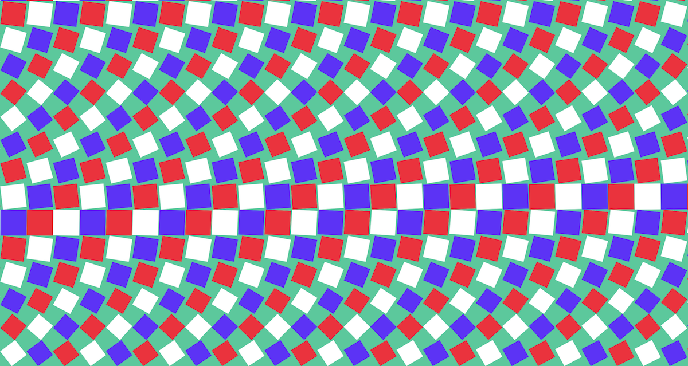

# react-pts-canvas

[](https://www.npmjs.com/package/react-pts-canvas)

`react-pts-canvas` is a small React component for drawing with
[Pts](https://ptsjs.org). It owns a `CanvasSpace`, connects it to React's
lifecycle, and passes the current space and form to typed callback props.



## Install

```bash
pnpm add react-pts-canvas pts
```

React 18.2 and React 19 are supported. The package ships ESM, CommonJS, and
TypeScript declarations; React, React DOM, and Pts remain peer dependencies.

## Quick start

```tsx
import { PtsCanvas } from "react-pts-canvas";

export function Drawing() {
  return (
    <PtsCanvas
      className="drawing"
      background="#182034"
      onAnimate={(space, form) => {
        form.fillOnly("#f6c").point(space.pointer, 12);
      }}
    />
  );
}
```

The wrapper needs an explicit size:

```css
.drawing {
  width: 100%;
  height: 24rem;
}
```

## Lifecycle callbacks

```tsx
<PtsCanvas
  onReady={(space, form, bound) => {
    // CanvasSpace is initialized and sized.
  }}
  onAnimate={(space, form, time, frameTime) => {
    // Called by Pts for every active animation frame.
  }}
  onPtsResize={(space, form, bound, event) => {
    // Called when Pts resizes the CanvasSpace.
  }}
  onAction={(space, form, type, x, y, event) => {
    // Receives Pts pointer, touch, and keyboard actions.
  }}
/>
```

Callback props can change without replacing the `CanvasSpace`. Changes to the
immutable setup props (`background`, `resize`, `retina`, `offscreen`,
`pixelDensity`, or `touch`) intentionally rebuild it.

## Props

| Prop              | Default       | Purpose                                    |
| ----------------- | ------------- | ------------------------------------------ |
| `name`            | `"pts-react"` | Base wrapper class and canvas class prefix |
| `className`       | —             | Additional wrapper classes                 |
| `canvasClassName` | —             | Additional canvas classes                  |
| `style`           | —             | Wrapper inline styles                      |
| `canvasStyle`     | —             | Canvas inline styles                       |
| `background`      | `"#9ab"`      | CanvasSpace background                     |
| `resize`          | `true`        | Resize with the wrapper                    |
| `retina`          | `true`        | Use device pixel density                   |
| `offscreen`       | `false`       | Enable Pts offscreen rendering             |
| `pixelDensity`    | —             | Override device pixel density              |
| `play`            | `true`        | Run or stop the animation loop             |
| `touch`           | `true`        | Bind Pts pointer and touch handling        |
| `refresh`         | `true`        | Clear before each frame                    |
| `tempo`           | —             | Add a Pts `Tempo` player                   |

Other canvas attributes such as `id`, `aria-label`, `data-*`, and React event
handlers are forwarded to the `<canvas>` element.

## Imperative access

The forwarded ref exposes the owned Pts objects without exposing lifecycle
control:

```tsx
import { useRef } from "react";
import { PtsCanvas, type PtsCanvasImperative } from "react-pts-canvas";

export function ControlledDrawing() {
  const ref = useRef<PtsCanvasImperative>(null);

  return (
    <>
      <button onClick={() => ref.current?.getSpace()?.playOnce(500)}>
        Draw one burst
      </button>
      <PtsCanvas ref={ref} play={false} className="drawing" />
    </>
  );
}
```

The getters are `getSpace`, `getForm`, `getPlayer`, and `getCanvas`. They return
`undefined` (or `null` for the canvas) before mount and after cleanup.

More complete examples live in
[`react-pts-canvas-examples`](https://github.com/williamngan/react-pts-canvas-examples).

## Development

This repository requires Node 20.19 or newer for Vite 8 and uses pnpm:

```bash
pnpm install
pnpm check
pnpm dev
```

`pnpm check` runs formatting, Oxlint, TypeScript, Playwright-backed browser
tests, library builds, and packed-package validation.

## License

Apache License 2.0. Copyright © 2019-current William Ngan and contributors.
